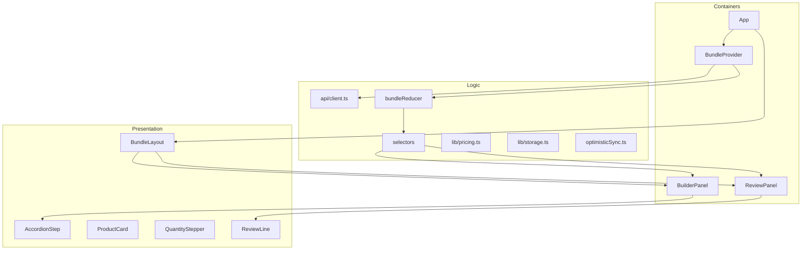

# Bundle Builder — Frontend Plan

Implementation plan for the EcomExperts take-home frontend in [`client/`](../client/). See also [AGENTS.md](../AGENTS.md), [client/COMPONENTS.md](../client/COMPONENTS.md), and [`.cursor/rules/client-fe.mdc`](../.cursor/rules/client-fe.mdc).

**Current state:** Frontend MVP complete (responsive at 3 breakpoints, tests passing, `VITE_USE_API=false`). Backend not started — see [BACKEND_PLAN.md](./BACKEND_PLAN.md).

## Principles

| Rule                     | Detail                                                                                              |
| ------------------------ | --------------------------------------------------------------------------------------------------- |
| FE first                 | `VITE_USE_API=false` + `local.ts` until server exists                                               |
| Single data door         | Components use `api.*` only — never import `bundle.json`                                            |
| Container / presentation | Smart wrappers read context + dispatch; dumb components take props + callbacks                      |
| Variant qty (critical)   | Key = `productId:variantId` or `productId:default`; test in Phase 3 before heavy UI                 |
| Responsive as you go     | Every UI component done for desktop, tablet, and mobile before moving on                            |
| Figma frames             | Desktop `1:342` · Tablet `1:27` · Mobile `1:658` — match structure per frame, do not shrink desktop |

## Architecture



### Four data layers

1. **Catalog** — read-only via `api.getConfig()`
2. **Runtime state** — `selections`, `activeVariants`, `openStepId` in reducer
3. **Derived** — review lines, totals, “N selected” via selectors (never stored)
4. **Persistence** — localStorage on “Save my system for later”

### Boot sequence

1. `api.getConfig()` → catalog
2. Check localStorage for saved snapshot
3. If saved → restore or `api.getConfiguration(id)` / create with snapshot
4. Else → `api.createConfiguration({})` with `initialSelections`
5. Render Figma seed state

## Components

Full descriptions: [client/COMPONENTS.md](../client/COMPONENTS.md).

| Component         | Type         | Description                                           | Contains                                            |
| ----------------- | ------------ | ----------------------------------------------------- | --------------------------------------------------- |
| `App`             | Container    | App root; bootstraps catalog and configuration        | Loading/error, `BundleProvider`, `BundleLayout`     |
| `BundleProvider`  | Container    | Global state via context and debounced API sync       | Reducer, catalog ref, sync hook, `useBundle*` hooks |
| `BundleLayout`    | Presentation | Responsive page shell for builder + review            | Two-column desktop; stack/drawer on mobile          |
| `BuilderPanel`    | Container    | Left column; orchestrates 4-step accordion            | `AccordionStep` × 4, `NextStepButton`               |
| `AccordionStep`   | Presentation | One builder step with collapsible header and body     | `StepHeader`, `ProductList`                         |
| `StepHeader`      | Presentation | Clickable accordion header (child of `AccordionStep`) | Title, “N selected”, expand chevron                 |
| `ProductList`     | Presentation | Renders all products in one step                      | List of `ProductCard`                               |
| `ProductCard`     | Presentation | Single product with variants and qty                  | Image, badge, title, chips, price, stepper          |
| `VariantChips`    | Presentation | Variant picker on product card                        | Chip buttons; `onSelect`                            |
| `NextStepButton`  | Presentation | Advances to next builder step                         | “Next: …” label, click handler                      |
| `ReviewPanel`     | Container    | Right column; live bundle summary                     | Groups, totals, actions                             |
| `ReviewGroup`     | Presentation | One review section (Cameras, Sensors, etc.)           | Section title, `ReviewLine` list                    |
| `ReviewLine`      | Presentation | One line per variant with qty > 0                     | Name, variant label, price, stepper                 |
| `ReviewTotals`    | Presentation | Order summary below line items                        | Shipping, guarantee, financing, total, savings      |
| `ReviewActions`   | Presentation | Primary actions at bottom of review                   | Checkout placeholder, Save for later                |
| `QuantityStepper` | Presentation | Shared +/- control (card + review)                    | Minus, count, plus; min/max bounds                  |
| `PriceBlock`      | Presentation | Formatted price display                               | Current price, optional compare-at                  |

## Folder structure to create

```
client/src/
├── api/
│   ├── client.ts
│   └── implementations/
│       ├── local.ts
│       └── http.ts
├── types/
│   ├── catalog.ts
│   └── configuration.ts
├── data/
│   └── bundle.json
├── state/
│   ├── bundleReducer.ts
│   ├── bundleContext.tsx
│   ├── selectors.ts
│   └── keys.ts
├── lib/
│   ├── pricing.ts
│   └── storage.ts
├── sync/
│   └── optimisticSync.ts
└── components/
    ├── layout/
    ├── builder/
    ├── review/
    └── shared/
```

## Responsive strategy

Build each UI component for all breakpoints before moving on.

| Tailwind       | Figma   | Typical behavior                     |
| -------------- | ------- | ------------------------------------ |
| `lg+`          | `1:342` | Two columns, full spacing            |
| `md`           | `1:27`  | Two columns or adjusted review width |
| default / `sm` | `1:658` | Stack, full-width, touch targets     |

### Per-component checklist

- [ ] Desktop `1:342`
- [ ] Tablet `1:27`
- [ ] Mobile `1:658`
- [ ] No horizontal overflow at 320px
- [ ] Touch-friendly stepper/chips

### UI build order

1. `BundleLayout` — responsive shell first
2. Shared atoms (`QuantityStepper`, `PriceBlock`, `VariantChips`)
3. `ProductCard` — hardest; nail responsive here
4. Rest of builder → review → totals/actions
5. Final full-page QA at 3 widths

---

## Phase 0 — Tooling and responsive shell

| Task                           | Output                                |
| ------------------------------ | ------------------------------------- |
| Install and configure Tailwind | `index.css`, design tokens            |
| Path alias `@/`                | `vite.config.ts`, `tsconfig.app.json` |
| `client/.env`                  | `VITE_USE_API=false`                  |
| Vitest                         | `pnpm test`                           |
| `BundleLayout`                 | Responsive two-column / stack shell   |
| Strip Vite starter             | Minimal `App.tsx`                     |

**UI touched:** `BundleLayout` only.

---

## Phase 1 — Types and catalog

| Task                     | Output                                    |
| ------------------------ | ----------------------------------------- |
| `types/catalog.ts`       | Step, Product, Variant, Meta              |
| `types/configuration.ts` | Selections, Configuration, patches        |
| `data/bundle.json`       | 4 steps from Figma desktop seed (`1:342`) |
| `state/keys.ts`          | `selectionKey(productId, variantId?)`     |

**UI touched:** None.

---

## Phase 2 — API layer

| Task                           | Output                          |
| ------------------------------ | ------------------------------- |
| `api/implementations/local.ts` | In-memory store + `bundle.json` |
| `api/client.ts`                | Facade + `VITE_USE_API` switch  |
| `api/implementations/http.ts`  | Stub for Phase 9                |

**Methods:** `getConfig`, `createConfiguration`, `getConfiguration`, `patchConfiguration`, `saveConfiguration`, `quote`, `checkout`.

**UI touched:** None (tests/logs only).

---

## Phase 3 — State, selectors, and pricing

| Task                     | Output                                                           |
| ------------------------ | ---------------------------------------------------------------- |
| `state/bundleReducer.ts` | `selections`, `activeVariants`, `openStepId`                     |
| Actions                  | `SET_OPEN_STEP`, `SET_ACTIVE_VARIANT`, `SET_QUANTITY`, `HYDRATE` |
| `state/selectors.ts`     | Step counts, review lines, totals                                |
| `lib/pricing.ts`         | Client preview totals                                            |
| Unit tests               | Critical variant rules (below)                                   |

**Critical tests (must pass before UI):**

1. Card stepper qty = active variant only
2. Switching chip shows that variant's count
3. Review lists every variant with qty > 0
4. No variants → `productId:default`
5. Totals derived, never stored in reducer

**UI touched:** None.

---

## Phase 4 — Provider and sync

| Task                      | Output                                      |
| ------------------------- | ------------------------------------------- |
| `state/bundleContext.tsx` | `BundleProvider` + hooks                    |
| Boot in `App`             | localStorage restore or createConfiguration |
| `sync/optimisticSync.ts`  | Debounced PATCH (~400ms)                    |
| `lib/storage.ts`          | Save/load snapshot                          |

**UI touched:** `App` container only.

---

## Phase 5 — Shared components (responsive)

| Order | Component         | Notes                               |
| ----- | ----------------- | ----------------------------------- |
| 1     | `QuantityStepper` | Larger tap targets on mobile        |
| 2     | `PriceBlock`      | Compare-at wrap on narrow screens   |
| 3     | `VariantChips`    | Wrap or horizontal scroll on mobile |

---

## Phase 6 — Builder UI (responsive per component)

| Order | Component                   |
| ----- | --------------------------- |
| 1     | `StepHeader`                |
| 2     | `ProductCard`               |
| 3     | `ProductList`               |
| 4     | `AccordionStep`             |
| 5     | `NextStepButton`            |
| 6     | `BuilderPanel` (wire state) |

**Behavior:** Step 1 open on load; accordion toggle; “N selected”; variant stepper binds to active chip; Next advances `openStepId`.

---

## Phase 7 — Review UI (responsive per component)

| Order | Component                                |
| ----- | ---------------------------------------- |
| 1     | `ReviewLine`                             |
| 2     | `ReviewGroup`                            |
| 3     | `ReviewTotals`                           |
| 4     | `ReviewActions`                          |
| 5     | `ReviewPanel` (wire state)               |
| 6     | Finalize `BundleLayout` review placement |

**Behavior:** Grouped sections; synced steppers; Save for later → localStorage.

---

## Phase 8 — Polish and QA

- Figma pixel check at 3 breakpoints
- Loading/error states in `App`
- Accessibility (accordion, steppers, focus)
- Full-page QA — fix gaps only, no structural responsive rebuild

---

## Phase 9 — Backend hookup (later)

When `server/` exists:

- Align types with `server/src/types/`
- Implement `http.ts`
- Vite proxy `/api/v1/*`
- Flip `VITE_USE_API=true`
- Server-authoritative quote/checkout

---

## Definition of done (frontend MVP)

- [x] All components implemented and responsive at 3 breakpoints
- [x] Variant qty rules pass tests
- [x] Review synced with builder
- [x] Save for later via localStorage
- [x] No component imports `bundle.json`
- [x] Works with `VITE_USE_API=false` without server

## Out of scope for v1

- Selected chip styling (deferred per brief)
- Real checkout / payment
- Server save (optional bonus)

## Suggested session order

| Session | Phases |
| ------- | ------ |
| 1       | 0 + 1  |
| 2       | 2      |
| 3       | 3      |
| 4       | 4      |
| 5       | 5      |
| 6–7     | 6      |
| 8–9     | 7      |
| 10      | 8      |
| 11+     | 9      |

## Progress tracking

Check off items in [AGENTS.md](../AGENTS.md) **Current phase** section as work completes.

## How to continue in a new session

Frontend work is complete. For new sessions:

- **Backend:** see [BACKEND_PLAN.md](./BACKEND_PLAN.md)
- **Frontend fixes only:** see [client/COMPONENTS.md](../client/COMPONENTS.md) and `AGENTS.md`
